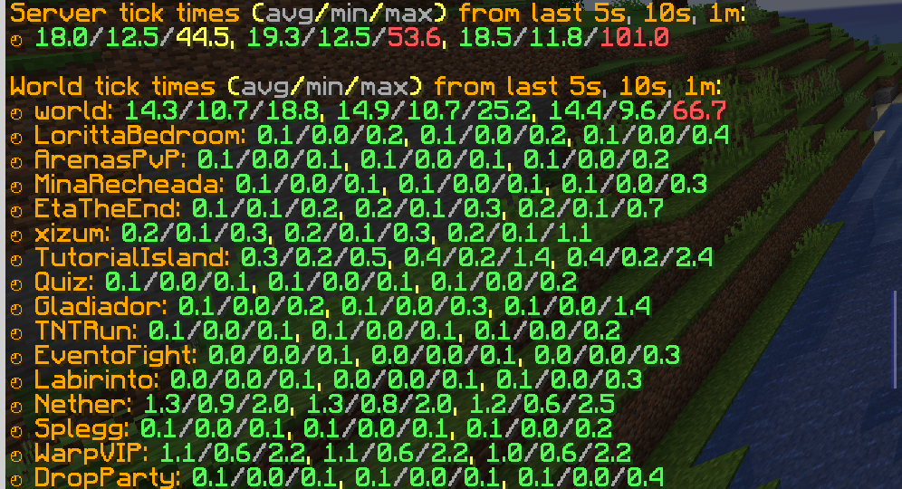

<h1 align="center">✨ SparklyPaper ✨</h1>

SparklyPower's Paper fork, with a mix of weird & crazy patches from other forks!

While our fork is mostly cherry-picked patches from other forks, we do have some handmade patches too to add and optimize some of the things that we have in our server!

## Features

This does not include all patches included in SparklyPaper, only the patches exclusive to SparklyPaper! To see all patches, check out the ["patches" directory](patches).

SparklyPaper's config file is `sparklypaper.yml`, the file is, by default, placed on the root of your server.

* Configurable Farm Land moisture tick rate when the block is already moisturised
  * The `isNearWater` check is costly, especially if you have a lot of farm lands. If the block is already moistured, we can change the tick rate of it to avoid these expensive `isNearWater` checks.
* Skip `distanceToSqr` call in `ServerEntity#sendChanges` if the delta movement hasn't changed
  * The `distanceToSqr` call is a bit expensive, so avoiding it is pretty nice, around ~15% calls are skipped with this check. Currently, we only check if both Vec3 objects have the same identity, that means, if they are literally the same object. (that works because Minecraft's code reuses the Vec3 object when caching the current delta movement)
* Skip `MapItem#update()` if the map does not have the CraftMapRenderer present
  * By default, maps, even those with custom renderers, fetch the world data to update the map data. With this change, "image in map" maps can avoid these hefty updates, without requiring the map to be locked, which some old map plugins may not do.
  * This has the disadvantage that the vanilla map data will never be updated while the CraftMapRenderer is not present, so if you readd the default renderer, the server will need to update the map data, but that's not a huuuge problem, after all, it is a very rare circumstance that you may need the map data to always be up-to-date when you have a custom renderer on the map.
  * If you made your own custom "image on map" plugin, you can get the same performance benefits if you change your code to set the locked state on the map with `mapView.isLocked = true`.
* Fix concurrency issues when using `imageToBytes` in multiple threads
  * Useful if one of your plugins is parallelizng map creation on server startup
* Check how much MSPT (milliseconds per tick) each world is using in `/mspt`
  * Useful to figure out which worlds are lagging your server.

* Parallel World Ticking
  * "mom can we have folia?" "we already have folia at home" folia at home: [Parallel World Ticking](docs/PARALLEL_WORLD_TICKING.md)

We don't cherry-pick *everything* from other forks, only patches that I can see and think "yeah, I can see how this would improve performance" or patches that target specific performance/feature pain points in our server are cherry-picked! In fact, some patches that are used in other forks [may be actually borked](docs/BORKED_PATCHES.md)...

## Support

Because this is a fork made for SparklyPower, we won't give support for any issues that may happen in your server when using SparklyPaper. We know that SparklyPaper may break some plugins, but unless we use these plugins on SparklyPower, we won't go out of our way to fix it!

If you only care about some of the patches included in SparklyPaper, it is better for you to [create your own fork](https://github.com/PaperMC/paperweight-examples) and cherry-pick the patches, this way you have full control of what patches you want to use in your server, and even create your own changes!

## Downloads

You can download SparklyPaper's Paperclip JAR [here](https://github.com/SparklyPower/SparklyPaper/actions/workflows/build.yml). Click on a workflow run, scroll down to the Artifacts, and download!